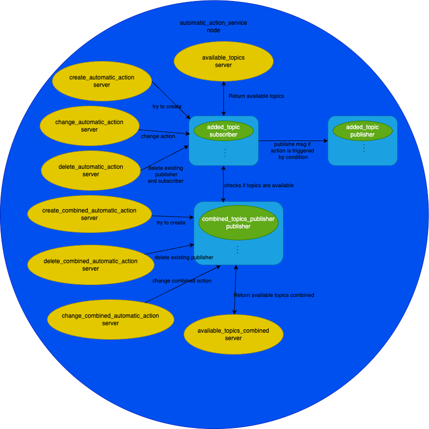

# Interface design
### Goals 
`wisevision_action_executor` provides functionality to create the following applications:
- Dynamic Subscription: The service is capable of subscribing to any topic specified by the user at runtime, along with the expected message type.
- Action Trigger: Upon detecting a particular value or condition within the messages of the subscribed topic, the service performs a predefined action. Predfined action is a string msg published to provide topic_name with contents of trigger_text
- Configuration Saving: Configuration details are saved in yaml config file to ensure persistence across restarts.
- Modular Design: The service is implemented as a separate package to ensure modularity and reusability.
- Data validity: every subscribed topic has argumnet.

## Architecture

This api architectur is created in one node, which has 4 services:
- /create_automatic_action
- /create_combined_automatic_action
- /delete_automatic_action
- /delete_combined_automatic_action
- /change_automatic_action
- /change_combined_automatic_action
- /available_topics
- /available_topics_combined

After creating subscriber and publisher there are topics with those names.



## Services
### create_automatic_action
- type: `automatic_action_msgs::srv::AutomaticAction`

- request:

| Type of Data | Name                | Purpose                                          |
|--------------|---------------------|--------------------------------------------------|
| string       | listen_topic        | Topic to which the service subscribes            |
| string       | listen_message_type | Expected message type for the subscribed topic   |
| string       | value               | Value to be checked within the messages          |
| string       | trigger_val         | Specific value or condition to trigger an action |
| string       | trigger_type        | Type of trigger to be used                       |
| string       | pub_topic           | Topic to which the service publishes             |
| string       | pub_message_type    | Message type for the published topic             |
| string       | trigger_text        | Text associated with the trigger condition       |
| int64        | data_validity_ms    | Validity duration of the data in milliseconds    |
|lora_msgs/FullDateTime | date_and_time | Data and time information                     |


- response:

| Type of Data | Name                | Purpose                                          |
|--------------|---------------------|--------------------------------------------------|
| bool         | success             | Indicates if the operation was successful        |

### delete_automatic_action
- type: `automatic_action_msgs::srv::AutomaticActionDelete`;

- request:

| Type of Data | Name                   | Purpose                          |
|--------------|------------------------|----------------------------------|
| string       | listen_topic_to_delete | Topic to be unsubscribed         |

- response:

| Type of Data | Name                   | Purpose                          |
|--------------|------------------------|----------------------------------|
| string       | listen_topic_to_delete | Topic to be unsubscribed         |

### create_combined_automatic_action
- type: `automatic_action_msgs::srv::AutomaticActionConnection`
- request:

| Type of Data | Name            | Purpose                                       |
|--------------|-----------------|-----------------------------------------------|
| string[]     | listen_topics   | Topics to which the service subscribes        |
| string       | logic_expression| Logic expression to evaluate the messages     |
| string       | pub_topic       | Topic to which the service publishes          |

- response:

| Type of Data | Name    | Purpose                                 |
|--------------|---------|-----------------------------------------|
| bool         | success | Indicates if the operation was successful|

- logic_expresion: to create logic expresion use `and`, `or`, `(`, `)`. To create logic expression for `/topic_a` and `/topic_b` pass to argument logic_expression this string: 
```
/topic_a and topic_b
```
for more topics or complicated logic is possible to use brackets like: 
```
(/topic_a and /topic_b) or /topic_b
```
### delete_create_combined_automatic_action
- type: `automatic_action_msgs::srv::AutomaticActionCombinedDelete`
- request:

| Type of Data | Name                            | Purpose                                         |
|--------------|---------------------------------|-------------------------------------------------|
| string       | name_of_combined_topics_publisher | Name of the combined topics publisher            |

- response:

| Type of Data | Name    | Purpose                                 |
|--------------|---------|-----------------------------------------|
| bool         | success | Indicates if the operation was successful|

### change_automatic_action
- type: `ChangeAutomaticAction`

- request:

| Type of Data | Name                              | Purpose                                                                                 |
|--------------|-----------------------------------|-----------------------------------------------------------------------------------------|
| `string`     | `action_and_publisher_name_to_change` | Name of the topic to be changed. Example: "/triggered_action".                          |
| `string`     | `listen_topic`                   | Name of the topic to be monitored. Example: "/sensor_data".                             |
| `string`     | `listen_message_type`            | Type of ROS message expected on the topic. Example: "std_msgs/String".                  |
| `string`     | `value`                          | Name of the field within the message to be evaluated. Example: "data".                  |
| `string`     | `trigger_val`                    | Threshold value for comparison. Example: "100.0".                                       |
| `string`     | `trigger_type`                   | Type of comparison (e.g., "LessThan", "GreaterThan", "EqualTo"). Example: "LessThan".   |
| `string`     | `new_action_and_publisher_name`  | Name of the topic for publishing if trigger is met. Example: "/triggered_action".       |
| `string`     | `pub_message_type`               | Type of ROS message to be published. Not in use. Example: "std_msgs/String".            |
| `string`     | `trigger_text`                   | Text content to be published if the trigger condition is met. Example: "Action triggered!". |
| `int64`      | `data_validity_ms`               | Validity period for data in milliseconds. Example: "1000".                              |
| `uint8`      | `publication_method`             | Method of notification delivery. Example: "0".                                          |

- response:

| Type of Data | Name            | Purpose                                                             |
|--------------|-----------------|---------------------------------------------------------------------|
| `bool`       | `success`       | Indicates whether the operation was successful. Example: "true".    |
| `string`     | `error_message` | Message with error details, if any. Example: "No such topic found." |

### change_automatic_action_combined
- type `ChangeAutomaticActionCombined`

- request:

| Type of Data | Name                              | Purpose                                                                                     |
|--------------|-----------------------------------|---------------------------------------------------------------------------------------------|
| `string`     | `action_and_publisher_name_to_change` | Name of the topic to be changed. Example: "/triggered_action".                              |
| `string[]`   | `listen_topics`                  | Array of topic names to be monitored. Example: ["/topic1", "/topic2", "/topic3"].           |
| `string`     | `logic_expression`               | Logical expression combining states of monitored topics. Example: "/topic1 and /topic2 or /topic3". |
| `string`     | `new_action_and_publisher_name`  | Name of the topic where a message will be published if the logic expression evaluates to true. Example: "/combined_action". |
| `string`     | `trigger_text`                   | Text content to be published if the logic expression evaluates to true. Example: "Action triggered!". |
| `uint8`      | `publication_method`             | Method of notification delivery. Example: "0".                                              |

- response:

| Type of Data | Name            | Purpose                                                             |
|--------------|-----------------|---------------------------------------------------------------------|
| `bool`       | `success`       | Indicates whether the operation was successful. Example: "true".    |
| `string`     | `error_message` | Message with error details, if any. Example: "No such topic found." |

### available_topics
- type: `automatic_action_msgs::srv::AvailableTopics`
- request:

| Type of Data | Name                            | Purpose                                         |
|--------------|---------------------------------|-------------------------------------------------|
| string       | name_of_combined_topics_publisher | Name of the combined topics publisher            |

- response:

| Type of Data | Name    | Purpose                                 |
|--------------|---------|-----------------------------------------|
| bool         | success | Indicates if the operation was successful|

### available_topics_combined

### AvailableTopicsCombined
- type: `lora_msgs::srv::AvailableTopicsCombined`

- request:

| Type of Data | Name | Purpose |
|--------------|------|---------|
| None         |      | This service does not require input data. |

- response:

| Type of Data                                           | Name                                         | Purpose                                                                                       |
|--------------------------------------------------------|----------------------------------------------|-----------------------------------------------------------------------------------------------|
| `lora_msgs/AutomaticActionCombinedRequestAndTime[]`    | `available_combined_topics_with_parameters_and_time` | List of available combined topics along with their parameters and timestamps. |


## Table of services

| Service name                                    | Service type                                              | Returns  | Comment                                                             |
|------------------------------------------------|----------------------------------------------------------|----------|---------------------------------------------------------------------|
| `/create_automatic_action`                      | `automatic_action_msgs::srv::AutomaticAction`            | Success  | Create an automatic action based on specified conditions            |
| `/delete_automatic_action`                      | `automatic_action_msgs::srv::AutomaticActionDelete`      | Success  | Delete an automatic action for a specified topic                    |
| `/create_combined_automatic_action`             | `automatic_action_msgs::srv::AutomaticActionConnection`  | Success  | Create a combined automatic action based on logic expressions       |
| `/delete_create_combined_automatic_action`      | `automatic_action_msgs::srv::AutomaticActionCombinedDelete` | Success  | Delete a combined automatic action by name                          |
| `/available_topics`                             | `automatic_action_msgs::srv::AvailableTopics`            | Success  | Retrieve available topics                                           |
| `/change_automatic_action`                      | `ChangeAutomaticAction`                                  | Success  | Modify the parameters of an existing automatic action               |
| `/change_combined_automatic_action`             | `ChangeAutomaticActionCombined`                          | Success  | Modify the parameters of an existing combined automatic action      |
| `/available_topics_combined`                    | `AvailableTopicsCombined`                                | Success  | Retrieve available combined topics along with their parameters      |

## Publishers
### Publisher created by user
- name: name of the publisher is set by service
- type: `std_msgs/msg/String`
- contents: contents of the publisher is set by service
### Publisher for notifcations
- name: `/notifcation`
- type: `notification_msgs/msg/Notification`
- contents: 
   - **`source`**: Origin of the notification (e.g., service/app name).  
   - **`severity`**: Importance level:  
      - `0`: NORMAL  
      - `1`: WARNING  
      - `2`: ERROR  
   - **`info`**: Additional details or message content.  
   - **`publication_method`**: Delivery method:  
      - `0`: EMAIL  
      - `1`: PUSH_NOTIFICATION  
      - `2`: WEB_PUSH_NOTIFICATION  
      - `3`: EMAIL_PUSH  
      - `4`: EMAIL_WEB_PUSH  
      - `5`: PUSH_WEB_PUSH  
      - `6`: EMAIL_PUSH_WEB_PUSH 

## Value  exctractor
Support for extrcarting values from msg types like:
- msg_value, example: 
  - from `std_msgs/msg/Int32` 
  - extrcat `data`
- msg_a.msg_b.msg_value, example: 
   - from `nav_msgs/msg/MapMetaData` 
   - extrcat `origin.position.x`
- array[msg_id="your_value"].msg_filed.value, example:
   - from `automatic_action_msgs/msg/Publisher` 
   - extrcat `sensors_value[id=101].temperature`

